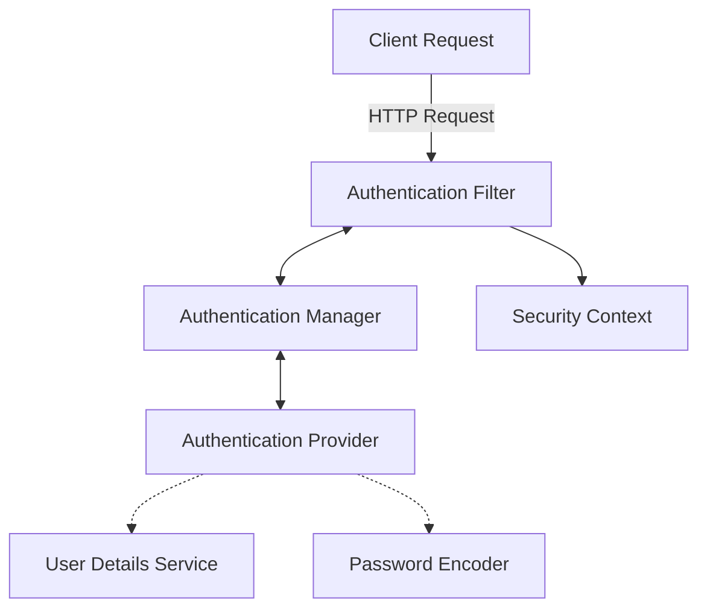
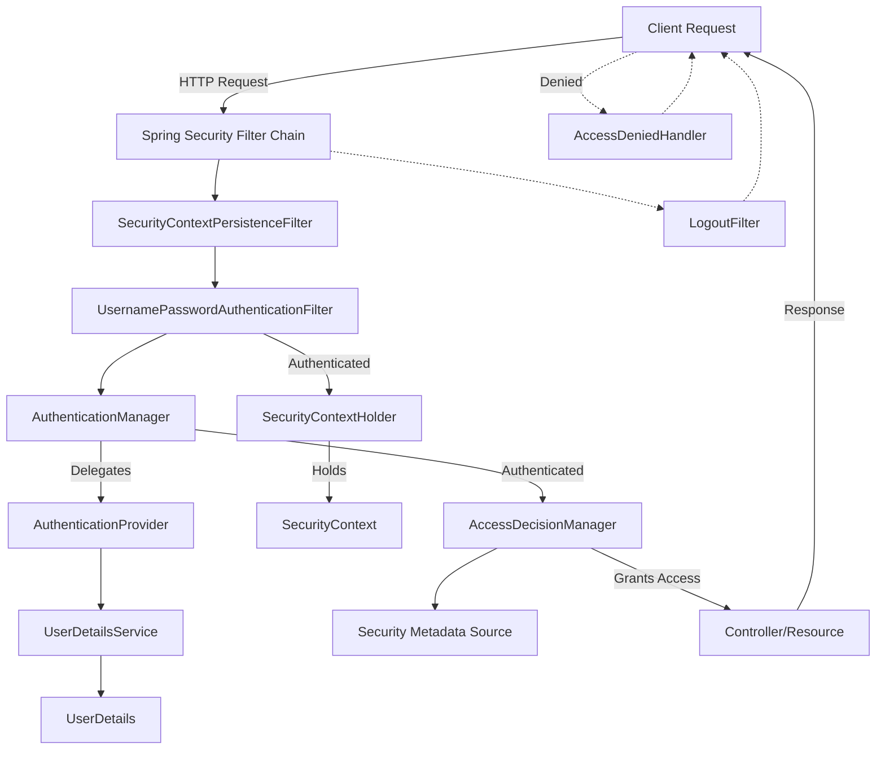

# Authentication
- understand authentication as identity verification you do while entering an airport. It do not make you eligible to board a flight, for which you need to pass authorization. But you can still atleast enter the airport.
- the easiest way for a client to query for an authentication is by sending required credentials in header under `Authorization` key.
- above is the brute force way, definitely in this approach user needs to pass username+password everytime client send a request (of course, client can encode to send over the internet, example base64 encoding)
- but passing sensitive details over the wire repeatedly might risk decoding by malicious users, they will figure it out eventually and mimic the users without them being aware.
- Also, keeping a DB interaction in authentication layer will heavily slow down the process, suppose if we have cache layer after authentication, then the purpose of serving client faster, is why we keep cache, and if authentication slow down our request to even reach to the cache layer then it defeats the purpose.
- instead when the first time login happen we can provide FE with an encrypted token to send in further requests.
- we will persist the decrypted token against that user in DB along with an expiry date, and validate to allow the request or reject it.
- although it is better than the previous solution, in terms of safety of our credentials, our sensitive data will be hard to capture and decode.
- drawback here is that still for every api call we need to talk to DB.
- DB interaction is expensive, so avoid it to be done everytime.
- instead we can use JWT(JSON Web Token)

# JWT
- JWT structure is 3 strings separated by 2 dots (.) - strA.strB.strC
- strA: basic info: { "alg": "SHA256", ... }
- strB: payload (usrname, expiryDate, etc...)
- strC: signature (unique secret comprises of normally 256 bits)
- structure: basic_info.payload(username, expiryDate, etc...).signature
- secretKey is created using encrypting algorithm like SHA256
- FE  -- usrnm + pswd --> BE (basicInfo --encode--> strA, payload --base64 encode --> strB, basicInfo+payload+secretKey --encode--> strC) --> give it back to FE
- didn't store anything in DB but FE store it now in browser.
- now validation -
- FE -- token --> BE (strA --decrypt--> basicInfo, strB --decrypt--> payload, basicInfo+payload+secretKey --encrypt--> candidate). if candidate == signature then authenticated.

## drawback
- what if expiry time is too small that usr gets frequently locked out then user needs to relogin in which DB calls for fetching creds and generating payload will be too frequent. Which will defeat the purpose.
- solution: along with token (jwt), we will also create refresh_token (jwt) with higher expiryTime and save it in DB.

so, FE -- token + refreshToken --> BE (token expired)
                                    |
                                   BE (fetch refresh_token from DB and compare)
                                    |
FE <--response + RT + new token <-- BE (if refresh_token is validated, create new token and send back to user)

If refresh token expires then do the relogin.

to add dependencies JWT -
```xml
<!-- https://mvnrepository.com/artifact/io.jsonwebtoken/jjwt-api -->
<dependency>
    <groupId>io.jsonwebtoken</groupId>
    <artifactId>jjwt-api</artifactId>
    <version>0.12.6</version>
</dependency>

<!-- https://mvnrepository.com/artifact/io.jsonwebtoken/jjwt-impl -->
<dependency>
    <groupId>io.jsonwebtoken</groupId>
    <artifactId>jjwt-impl</artifactId>
    <version>0.12.6</version>
    <scope>runtime</scope>
</dependency>

<!-- https://mvnrepository.com/artifact/io.jsonwebtoken/jjwt-jackson -->
<dependency>
    <groupId>io.jsonwebtoken</groupId>
    <artifactId>jjwt-jackson</artifactId>
    <version>0.12.6</version>
    <scope>runtime</scope>
</dependency>
```
- you can check basic JWT token generation and validation in `JwtUtils`

## Exercise 1 (minor)
- create `/sign-up`, `/log-in`, `/log-out` and authentication on a controller route using login token
- for `/sign-up` make username unique and send with password, and once it is done, generate and hand the token
- if token expires, the redirect to `/log-in`, ask for username and password again. If matches, generate and return a new token.
- for other apis, a mandatory token should be received.
- for `/logout` first check whether the token is valid, then, instruct FE to delete token from `localstorage`.
- or for `/logout` first check whether the token is valid, then, generate a new token with almost no life and instruct FE to update the token, as soon as next replace will come, user will get redirected to `/login`.
- so in case of `/logout`, server do not need to do anything, just validate current token and strategize on evicting the token from FE end.

# security vulnerabilities
## denial of service (DoS attack)
- happens on server
- server is bombarded with too many requests
- solution: rate limiting on requests received from a particular IP.
- but attacker may change IP as well, hence companies have ML algos to limit these type of cases
## CSRF
- happens on browser
- Cross Site Request Forgery
- A user sent you link of a script, you clicks and it opens in browser.
- It has JS code to transfer fund from your account, it only needs your token
- which it takes from your `localstorage` and then will make the call.
- solution 1/2: banks keep token expiry time very small
- solution 2/2: two-factor authentication for payment.
- HW: find how it is prevented
## CORS
- happens on browser
- Cross Origin Resource Sharing
- browsers are designed to prevent it.
- before browser makes a request, it tries to get valid origins list from servers from which server wants to entertain requests.
- because servers can refuse to entertain requests from unknown source/origin
- once browser gets the list of valid origins from server, it checks if current website is present in that list or not.
- If present, then API call will be made, otherwise not
- scammers can still do CORS via proxy. unauthorized FE --> calls an unauthorized BE --> BE makes the call. As browser checks origin in the list but servers doesn't.

# Spring Security
add spring-boot-starter-security dependency to use spring-security -
```xml
<!-- https://mvnrepository.com/artifact/org.springframework.boot/spring-boot-starter-security -->
<dependency>
    <groupId>org.springframework.boot</groupId>
    <artifactId>spring-boot-starter-security</artifactId>
    <version>3.3.3</version>
</dependency>
```
- as soon as the dependency is included in project structure
- spring-security will implement a password based authentication and prevent all api calls and start throwing `401 Unauthorized`
- only those calls will be allowed which are validated using the generated password under a default username `user`
- the details you have to send in request headers under name `Authorization` after selecting `Basic Authroization` from the dropdown
- it will send a base64 encrypted request of your user-name and password
## Architecture
- The request is intercepted by authentication-filter interface (analogous to tomcat filters)
- Authentication responsibility is delegated to authentication-manager interface
- The authentication-manager uses the authentication-provider which implements authentication logic.
- The authentication-provider finds the user with a user-details-service and validates the password using a password-encoder
- the result of authentication is returned to the authentication-filter
- authentication-provider propagates result back to AM, which sends it back to AF
- AF stores details about the authenticated entity into security-context
- security-filter chain gets executed after TomCat filters or custom filters that we wrote


## Write custom `UserDetailsService` and `PasswordEncoder`
- `InMemoryUserDetailsManager` is one of the five `UserDetailsService` implementation which is used by default
- `UserDetailsService` interface has only one method defined - `loadUserByUsername(String username)`
- `InMemoryUserDetailsManager` keeps all the detail in RAM
- `InMemoryUserDetailsManager` keeps a map of userName:userDetails
- it has multiple constructors, one of them takes a `Collection` of users and puts all of them in map.
- the details it keeps is of type `MutableUser` which implements `MutableUserDetails` and has `password` as one of the components of details
- `InMemoryUserDetailsManager` has many methods related to username and password
- `InMemoryUserDetailsManager` implementation of `loadUserByUsername(String username)` is simple, it gets the user from map, if not found throws an error.
- loadUserByUserName("user") will give all the details of creds made by spring-security by default for you.
- `InMemoryUserDetailsManager` while creating a set of default creds also create other details for it, like authorities provided under `GrantedAuthority`
- `NoOpPasswordEncoder` is the implementation of `PasswordEncoder` which is used by default with password validation along with `InMemoryUserDetailsManager`
- similarly, we can create a bean of our own custom `UserDetailsService` and `PasswordEncoder` using `@Configuration/@Bean` annotations
- but as soon as we create a custom bean of `UserDetailsService`, spring-security stops making default bean of `InMemoryUserDetailsManager`
- but spring-security still keeps the architecture in place, so we need to create creds as well along with custom bean otherwise we won't be able to log in.
```java
@Bean
public UserDetailsService inMemoryCustomUserDetailsService() {
    List<UserDetails> userDetails = new ArrayList<>(); // it will store user authentication details in RAM
    userDetails.add(User.withUsername("samar").password("samar-taj").authorities("read").build());
    userDetails.add(User.withUsername("Maheen").password("maheen-samar").authorities("read", "write").build());
    userDetails.add(User.withUsername("rubab").password("rubab-samar").roles("ADMIN").build());
    return new InMemoryUserDetailsManager(userDetails);
}
```
- but this alone won't work, we need an implementation of `PasswordEncoder` as well.
```java
@Bean
public PasswordEncoder passwordEncoder() {
    return NoOpPasswordEncoder.getInstance();
}
```
- Now, use your custom creds, they will work.
- the new flow after introducing spring-security is - 
  - request --> goes through TomCat -> Filter1 --> Filter2 ... -> Filter n -> our custom servlet filter-chain -> `DefaultSecurityFilterChain` -> DispatcherServlet
- so, spring-security sits at the level of TomCat filters, by creating its own filter-chain which runs after all TomCat filters ran.
- if that is through, then request is handed over to spring-mvc
- the advantage we have in spring-security over TomCat filter is, the only drawback we had with servlet filters is got resolved.
- as we know there was no way to customize servlet filter to run on requests which came over a specific path, they used to run over every request.
- spring-security filter-chain can be customized to be invoked only no specific routes.

## HW
write custom `AuthenticationProvider`

## AuthenticationProvider
- it has a method `authenticate(Authentication authentication)` which returns `Authentication`
- `Authentication` instance contains all details against which a user got authenticated.
- it contains, creds details, authorities, principal, isAuthenticated, and other details.
- `UsernamePasswordAuthenticationToken` is the implementation of `Authentication` used by default with `InMemoryUserDetailsManager` and `NoOpPasswordEncoder`
- hence, we can infer that `Authentication` is an interface implementing token properties
- so, `authenticate()` implementation takes in the token that came in request, validates/verifies it, and generates a token corresponding to it for internal use.
- if internal-token says to `AuthenticationFilter` that everything is good, then spring-security filter-chain is passed on otherwise request is failed.
