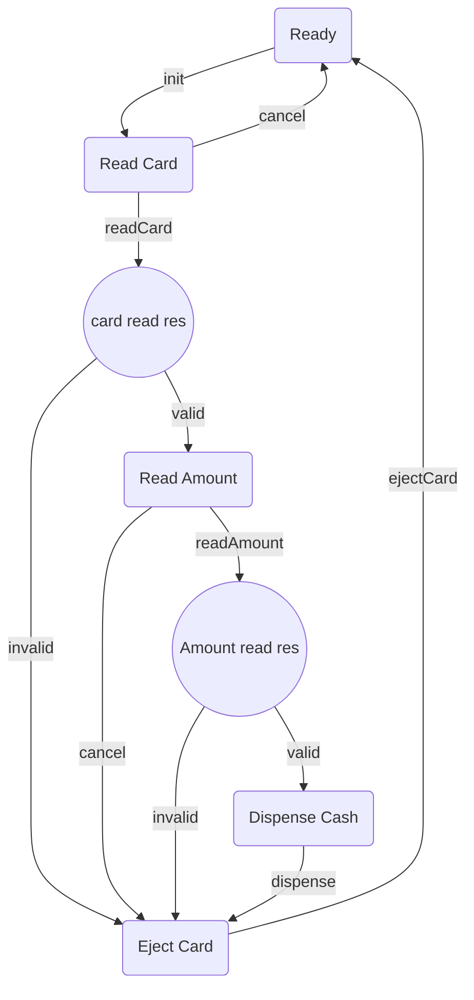

state diagram -

```mermaid
flowchart TD
    A(Ready)
    B(Read Card)
    C((card read res))
    D(Eject Card)
    E(Read Amount)
    F((Amount read res))
    G(Dispense Cash)
    
    A --> |init| B
    B --> |cancel| A
    B --> |readCard| C
    C --> |invalid| D
    C --> |valid| E
    E --> |cancel| D
    E --> |readAmount| F
    F --> |invalid| D
    F --> |valid| G
    G --> |dispense| D
    D --> |ejectCard| A

```