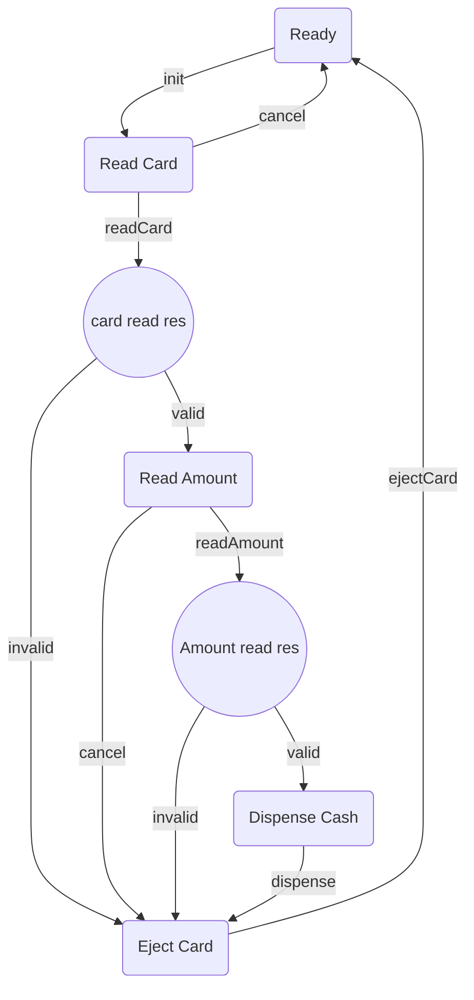

### state diagram -

### Discussion
Current state will decide how transitions will happen. All such processes which works on states and their current value are called state machines. State Design Pattern is a common way to approach designing such a software.

In State design pattern, we invert our approach. Instead of checking for which states current transition can proceed, we create a separate implementation for each class and write specific transition logic for each state separately.
