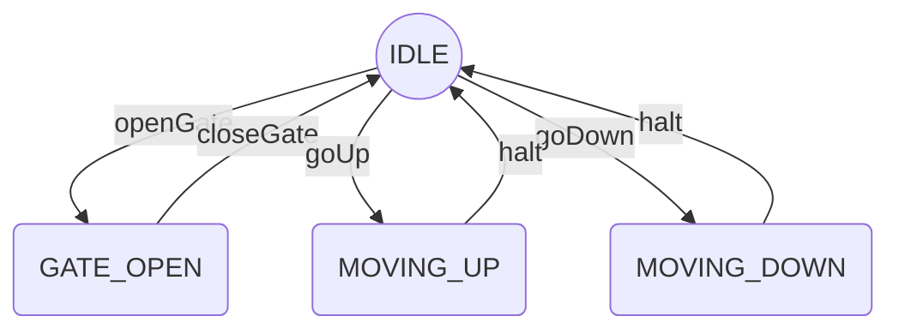

```mermaid
flowchart TD
    A((IDLE))
    B(MOVING_UP)
    C(MOVING_DOWN)
    D(GATE_OPEN)
    
    A --> |openGate| D
    D --> |closeGate| A
    A --> |goUp| B
    A --> |goDown| C
    B --> |halt| A
    C --> |halt| A
```