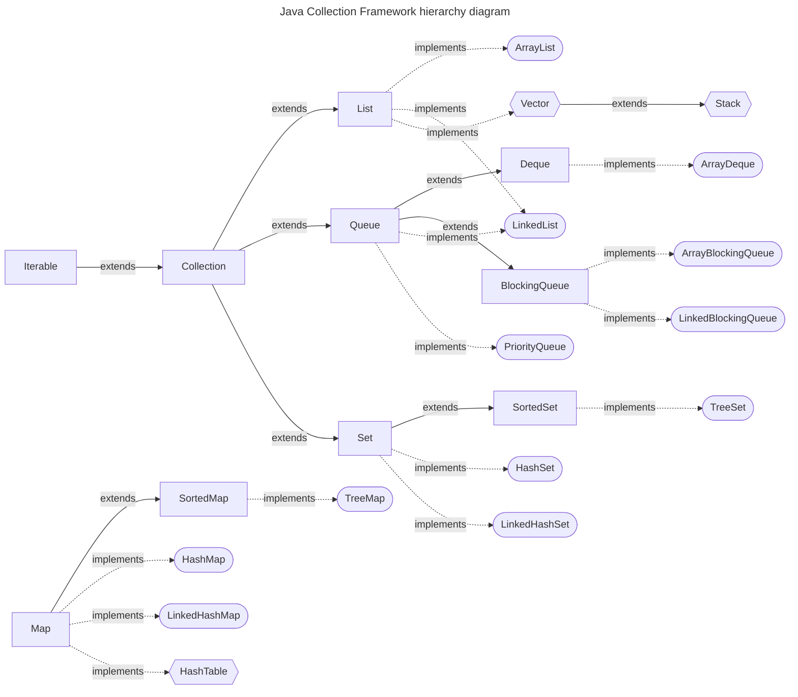

# Java Collections Framework (JCF)

The **Java Collections Framework (JCF)** is a unified architecture for representing and manipulating collections of data in Java. It provides:
- **Interfaces**: Define the basic operations that can be performed on different types of collections (e.g., `List`, `Set`, `Map`).
- **Implementations**: Concrete classes that implement the interfaces (e.g., `ArrayList`, `HashSet`, `HashMap`).
- **Algorithms**: Methods that perform useful operations like searching, sorting, and manipulating collections.

## Core Interfaces of the JCF
The Java Collections Framework is built on several core interfaces, which define different types of collections:

### Collection
The root interface representing a group of objects known as elements.
- **Sub-interfaces**:
  - **List**: An ordered collection (sequence) of elements.
  - **Set**: A collection that does not allow duplicate elements.
  - **Queue**: A collection that follows the FIFO (First-In-First-Out) principle.

### Map
Represents a collection of key-value pairs. Keys are unique, and each key maps to exactly one value.
- **Sub-interfaces**:
  - `SortedMap`
  - `NavigableMap`

## Important Interfaces in JCF
- **List Interface**:
    - A `List` allows ordered access to elements. You can add, access, and remove elements based on their index.
    - Common implementations:
        - `ArrayList`: Uses an array internally.
        - `LinkedList`: Implements a doubly linked list.
        - (Legacy) `Vector`

- **Set Interface**:
    - A `Set` enforces the uniqueness of its elements (no duplicates).
    - Common implementations:
        - `HashSet`: Uses a hash table to store elements.
        - `TreeSet`: Orders elements using a Red-Black tree.

- **Map Interface**:
    - A `Map` maps keys to values. Keys are unique, and each key can map to only one value.
    - Common implementations:
        - `HashMap`: Uses a hash table to store key-value pairs.
        - `TreeMap`: Orders keys using a Red-Black tree.

- **Queue Interface**:
    - A `Queue` holds elements before processing them in a first-in, first-out (FIFO) manner.
    - Common implementations:
        - `LinkedList`: Can act as a queue.
        - `PriorityQueue`: A queue where elements are ordered based on their natural order or a comparator.

## Implementations of Collection Interfaces
Each of the interfaces mentioned above has several concrete classes that provide different ways of storing and retrieving data. These are:
- **Array-based**: `ArrayList`, `ArrayDeque`
- **Linked-list-based**: `LinkedList`
- **Hash-based**: `HashSet`, `HashMap`, `LinkedHashSet`, `LinkedHashMap`
- **Tree-based**: `TreeSet`, `TreeMap`

## Key Methods of Collection Interface
Some common methods across collections include:
- `boolean add(E element)`: Adds an element to the collection.
- `boolean addAll(Collection<? extends E> c)`: Adds all the elements
- `boolean remove(Object o)`: Removes the specified element.
- `boolean removeAll(Collection<?> c)`
- `boolean contains(Object o)`: Checks if the collection contains the specified element.
- `boolean containsAll(Collection<?> c)`: Returns true if this collection contains all the elements
- `int size()`: Returns the size of the collection.
- `Iterator<E> iterator()`: Returns an iterator over the collection.
- `isEmpty()`: Returns true if this collection contains no elements.
- `default boolean removeIf(Predicate<? super E> filter)`: Removes all the elements of this collection that satisfy the given predicate
- `boolean retainAll(Collection<?> c)`: Retains only the elements in this collection that are contained in the specified collection
- `void clear()`: Removes all the elements from this 
- `boolean equals(Object o)`: Compares the specified object with this collection for equality
