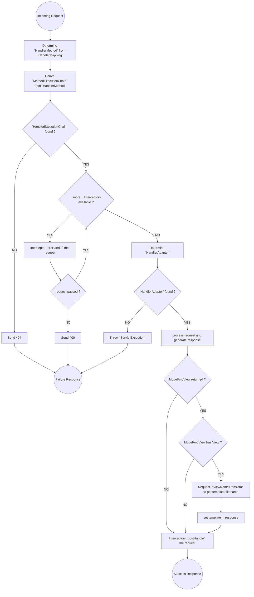

- all this code was to explain how DispatcherServlet works.
- you won't be coding like this in real-world application
- in real-world, `@RestController` and `@Controller` will be sufficed.

## Flow Chart
