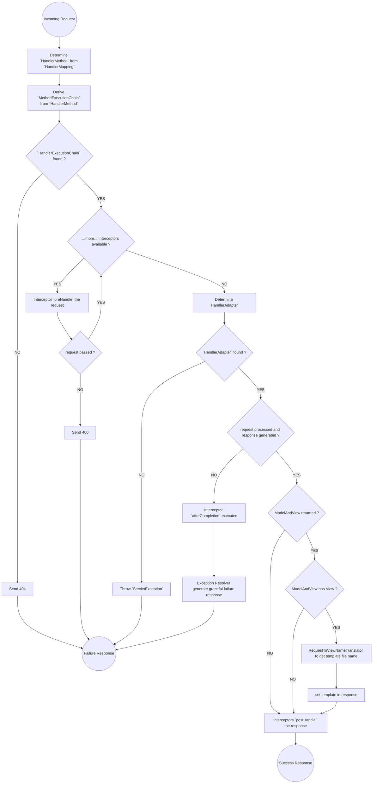

# HTTP Basics
## Definition of HTTP
HTTP (Hypertext Transfer Protocol) is an application layer protocol used for transferring information across the web. The information to be transmitted is formatted as a structured text containing details of a destination in the form of a link/url/path. The text present has distinct components, each with a unique role.

## Stateless Nature of HTTP
HTTP is stateless, meaning each request from a client to a server is independent, and the server does not store any state or session information about the client between requests. Example, Iterator is stateful but pagination API sending page info is not.

### Benefits of Statelessness
- **Scalability:** Since the server doesn’t need to maintain client context, any server can handle a request, making load balancing easier.
- **Interoperability:** Stateless architecture makes it easier for different systems to interact seamlessly.

### How Do Recommendation Systems Work if HTTP is Stateless?
Because HTTP is stateless, technologies like cookies and tokens are used to maintain session information between the client and server. These are passed as part of the HTTP request, enabling the server to recognize the client and provide personalized content. Here's a brief overview:
- **Cookies:** Stored on the client side, used to remember user sessions, preferences, etc.
- **Tokens (JWT - JSON Web Tokens):** Tokens can be sent with each request to authenticate users and maintain their session.
```java
// This example demonstrates how to create, set, and read cookies within a Java servlet or Spring controller.
// Example of setting a cookie in an HTTP response
Cookie userSession = new Cookie("user-session", "session-id-123");
userSession.setMaxAge(60 * 60); // 1 hour validity
response.addCookie(userSession);

// Reading a cookie from the request
Cookie[] cookies = request.getCookies();
if (cookies != null) {
    for (Cookie cookie : cookies) {
        if ("user-session".equals(cookie.getName())) {
            String sessionId = cookie.getValue();
            // Process the session ID...
        }
    }
}
```

## Components of an HTTP Request
An HTTP request consists of several components, each serving a unique role in client-server communication:
- **Method:** Defines the action to be performed (e.g., GET, POST, PATCH, PUT, DELETE).
- **URL:** The resource's location. Should be highly readable. (e.g., /book/123).
- **Version:** HTTP versions, with newer versions supporting optimizations like persistent/keep-alive connections.
- **Headers:** Meta-information (e.g., Content-Type: application/json, Authorization, etc.) for content negotiation and request handling.
- **Body:** Optional, if added contains the request data, typically in POST and PUT requests.
```shell
GET /books/search?title=java HTTP/1.1
Host: www.bookstore.com
Authorization: Bearer token-abc123

# In this request, we are making a GET call to search for books with the title "java" on a bookstore website. The Authorization header contains a token to authenticate the request.
```
- **path-variable:** Optional to add, but strictly compulsory if declared in an URL. Part of the URL, used to uniquely define resource and at the same time get more details on what resource is requested. Usually composed of values which are mandatory, unique, small and do not compromise with readability, e.g. - ids in URL. Also known as **request-path**.
- **request-params:** Optional to add, but can be made optional even after declaring in a request. Used as a key-value pair appended to URL after `?`. Usually added for optional fields or when values of keys are large, e.g.—for adding filters, searches, etc.
```java
// Example: Using path variables and request parameters
@GetMapping("/books/{id}")
public Book getBookById(@PathVariable("id") Long bookId) {
    // Retrieve the book by ID
    return bookService.findBookById(bookId);
}

@GetMapping("/books/search")
public List<Book> searchBooks(@RequestParam("title") String title) {
    // Search for books by title
    return bookService.searchBooksByTitle(title);
}
```

## Components of an HTTP Response
- **Status Code:** Numerical code representing the result of the request (e.g., 200 OK, 404 Not Found).
- **Status Message:** Accompanies the status code to provide additional information.
- **Headers:** Meta-information about the response, like `Content-Type` or `Set-Cookie`.
- **Body:** The actual content of the response can be in HTML, JSON, or XML format.
```shell
HTTP/1.1 200 OK
Content-Type: application/json
{
  "id": 123,
  "title": "Effective Java",
  "author": "Joshua Bloch"
}
```
```java
@GetMapping("/books/{id}")
public ResponseEntity<Book> getBookById(@PathVariable("id") Long bookId) {
    Book book = bookService.findBookById(bookId);
    if (book != null) {
        return ResponseEntity.ok(book); // HTTP 200 OK
    } else {
        return ResponseEntity.status(HttpStatus.NOT_FOUND).body(null); // HTTP 404 Not Found
    }
}
```

# Servlet
An HTTP server acts as an intermediary between OS and Spring MVC dispatcher-servlet, listens to a port, accepts incoming HTTP requests from kernel (OS) and forward them to forward-controller. In Java, it is called as servlet, which can be understood as 'let us serve'. Servlets operate within an environment called a Servlet Container. Examples of servlet containers include Tomcat and Jetty.

## Servlet Lifecycle:
A Servlet is defined by implementing the `javax.servlet.Servlet` interface, which includes three key methods:
- `init()`: Initializes the servlet with necessary resources and dependencies.
- `service()`: This method handles incoming requests and sends appropriate responses. It delegates the request to Spring MVC.
- `destroy()`: Cleans up resources before the servlet is shut down.

## Traditional Deployment and its Challenges
In pre-Spring framework days, developers would often generate a JAR file using Maven (`mvn install`) in `/target` folder and deploy it manually on a standalone server. This was common in pre-containerized environments, as containerization ensured that application and server share the same environment. However, this approach had several drawbacks:
### Compatibility issues:
- The server's Java version might differ from the application's Java version, leading to runtime problems.
- **Single Point of Failure (SPOF):** If the server failed, all applications running on it would be affected.
- **Difficulties in managing multiple applications:** Each application might require a different server configuration, making it hard to manage on a single server instance.

Despite these drawbacks, standalone servers had the benefit of running multiple applications at once.

# Spring MVC
Spring MVC enables web application development. It is built on top of the Servlet API. It follows the Model-View-Controller design pattern, which helps in separating concerns:
- **Model:** Represents the application data and business logic.
- **View:** Responsible for rendering the user interface.
- **Controller:** Handles user input and interacts with the Model to update the view.

## Controllers
In Spring MVC, controllers are the components that consume HTTP requests and generate responses.

### @Controller
This is a Spring MVC component that marks a class as a web controller. By default, methods in a @Controller return views (HTML templates). To send raw responses (such as JSON), you need to use `@ResponseBody`.
```java
@Controller
@RequestMapping("/simple")
public class SimpleController {

  @GetMapping
//  @ResponseBody // to send raw response with @Controller
  public String hello() {
    return "hello"; // If a return type is a String, then responds with template having the name "hello"
  }
}
```

### @RestController
Spring MVC supports building RESTful web services using `@RestController`. It combines `@Controller` and `@ResponseBody` by automatically converting Java objects into JSON (or XML) using Jackson (or another library) via custom response class getters/setters (@Getter/@Setter can also be used) and writing it directly to the HTTP response body. The conversion ability of jackson is abstracted in `HTTPMessageConverter` interface. Spring MVC comes with only Java objects to JSON serialization/deserialization implementation of `HTTPMessageConverter` interface out of the box. If serialization/deserialization of any other format (like xml) is required, then its implementation needs to be imported as a dependency (`jackson-dataformat-xml`).
```java
// produces: response produced is serialized into an XML file
@RequestMapping(method = RequestMethod.GET, value = "result", produces = "application/xml")
public ExamResult getExamResult() {
    System.out.println("Received result request");
    return new ExamResult(70, 80, 90);
}
```

#### Note:
Usually `GET` request do not contain a body, as we do not prefer too much data via `GET method. So, Spring Jackson has capability to bind HTTP request-params into a request body object by using its constructor/setter (if it can be translated).
```java
// Do not use it extensively, as it is not reliable and not a good practice as well.
// Curl --location 'http://localhost:8080/simple/result/examine?physics=70&chemistry=65&maths=80'
@RequestMapping(method = RequestMethod.GET, value = "result/examine")
public String examineResult(ExamResult examResult) {
    System.out.println("Received examine result request with " + examResult);
    if ((double)examResult.getTotal() /examResult.getMaxScore() >= 0.7) {
        return "passed";
    }
    return "failed";
}
```

### Custom Controllers
```java
public class BadController implements Controller {

    // http://localhost:8080/add?a=10&b=20
    @Override
    public ModelAndView handleRequest(HttpServletRequest request, HttpServletResponse response) throws Exception {
        int sum = Integer.parseInt(request.getParameter("a")) + Integer.parseInt(request.getParameter("b"));
        response.getWriter().write("{ sum: " + sum + " } ");
        return null;
    }
}
```

#### Note:
Always go for annotations, never write a controller using interface like shown above. This is for explanation purposes.

## @RequestMapping
It is an annotation used to map HTTP requests to specific handler methods within a controller. It allows the configuration of various request-handling properties and has features like -
- `path`/`value`: Maps the request URL to a specific method in the controller.
- `method`: Specifies the type of HTTP request (e.g., GET, POST).
- `produces`: response type produced while serialization
- `consumes`: request body type that is consumed for deserialization
- `headers` and `params`: Allows filtering requests based on specific HTTP headers or parameters.
```java
@Controller
@RequestMapping("/api")
public class ApiController {

    @RequestMapping("/data")
    public String getData(Model model) {
        model.addAttribute("data", "Some API data");
        return "dataView";
    }
}
```

## Request Handling
This process is primarily managed by two key classes:
- `RequestMappingHandlerMapping`: It is responsible for identifying which `HandlerMethod` (controller method) should handle a specific request. It matches requests to methods based on URL patterns, HTTP methods, parameters, headers, and other attributes specified by the `@RequestMapping` annotation.
- `RequestMappingHandlerAdapter`: Once a `HandlerMethod` is identified, it takes over. It is responsible for invocation and processing both the input and the output.

### Role of `RequestMappingHandlerAdapter`
The process includes:
#### **Resolving method arguments** (using `HandlerMethodArgumentResolver`)
- The `RequestMappingHandlerAdapter` maintains a list of implementations of the `HandlerMethodArgumentResolver` interface.
- When a controller method is called, it often needs to accept various parameters from the HTTP request (such as query parameters, path variables, request bodies, session attributes, etc.).
- The `RequestMappingHandlerAdapter` loops over each parameter of the `HandlerMethod` and consults the list of `HandlerMethodArgumentResolver` implementations to find one that can resolve the argument for each parameter.
- Examples include `RequestParamMethodArgumentResolver` for handling query parameters (annotated with `@RequestParam`), `PathVariableMethodArgumentResolver` for path variables (annotated with `@PathVariable`), and `RequestBodyMethodArgumentResolver` for request bodies (annotated with `@RequestBody`).
#### **Invoking the identified controller (`HandlerMethod`) method**
#### **Handling the return value (using `HandlerMethodReturnValueHandler`)**
- Once `HandlerMethod` invocation finishes and a response is returned. The `RequestMappingHandlerAdapter` processes the return value using implementations of the `HandlerMethodReturnValueHandler` interface.
- The `RequestMappingHandlerAdapter` maintains a list of implementations of the `HandlerMethodReturnValueHandler` interface.
- Example, the `ViewNameMethodReturnValueHandler` handles `String` return types, while `RequestResponseBodyMethodProcessor` handles objects returned as JSON or XML, and if a `ResponseEntity` is returned, it is processed by the `HttpEntityMethodProcessor`.
#### **Composing and Dispatching the HTTP response**

### Additional Components Involved:
- **`HttpMessageConverter`**: Used in the serialization of request bodies (from JSON, XML, etc.) into objects, and response bodies from objects into JSON, XML, etc.
- **`ModelAndView`**: Often used when the return value is a logical view name and model data needs to be passed to the view layer for rendering.
- **`HandlerInterceptor`**: Intercepts the HTTP request before and after the handler method is executed.

## @RequestParam
With this, Spring will automatically bind params in HTTP request to method argument variables. Example on how to use it -
```java
// http://localhost:8080/simple/greet?name=samar&say=goodbye
@RequestMapping(method = RequestMethod.GET, value = "/greet")
public String greetWithParam(
        @RequestParam(value = "name", defaultValue = "World") String name) {
    System.out.println("Received request with param 'name' " + name);
    return String.format("Hello %s!", name);
}
```

## @PathVariable
example on how to use it -
```java
// http://localhost:8080/simple/greet/samar
@RequestMapping(method = RequestMethod.GET, value = "/greet/{name}")
public String greetWithPath(
        @PathVariable("name") String name) {
    System.out.println("Received request with path variable 'name' " + name);
    return String.format("Good Bye %s!", name);
}
```

## DispatcherServlet
Servlet exists in TomCat, and it hands over received request to the DispatcherServlet. It is the Front Controller and starting point of a Spring MVC framework. After receiving request, DispatcherServlet routes it to the appropriate controller based on the `HandlerMapping` (controller methods mapped to a route). Inside DispatcherServlet, The request goes through chain of interceptors (in order of declaration) before reaching the controller and the response generated also travels back through all the interceptors (in reverse order of declaration) before being handed over to the servlet.
```java
@Configuration
@EnableWebMvc // it will signal spring-mvc to review this class, as it will not go looking for custom beans
public class UrlConfig {

    // once spring-mvc receives the signal, it will review the class and when it finds a HandlerMapping
    // then spring-mvc will inject this mapping in the list of HandlerMapping of DispatcherServlet
    @Bean
    public HandlerMapping createHandlerMapping() {
        SimpleUrlHandlerMapping handlerMapping = new SimpleUrlHandlerMapping();
        Map<String, Controller> urlMap = new HashMap<>();
        urlMap.put("/add", new BadController());
        handlerMapping.setUrlMap(urlMap);
        return handlerMapping;
    }
}
```

## Design Pattern: Front Controller
The Front Controller pattern is used in Spring MVC to centralize request handling. It is composed of -
- `HandlerExecutionChain`
- `HandlerInterceptor`
- `HandlerMethod`
- `HandlerAdapter`
- `HandlerExceptionResolver`
```java
public class DispatcherServlet extends FrameworkServlet {
    @Override
    protected void doDispatch(HttpServletRequest request, HttpServletResponse response) throws Exception {
        Exception dispatchException = null;
        ModelAndView processedResponse = null;
        HandlerExecutionChain mappedHandler = null;
        try {
            // Finds the handler (controller method) based on URL
            mappedHandler = getHandler(request);
            if (mappedHandler == null) {
                this.noHandlerFound(request, response);
                return;
            }
  
            // Executes preHandle() methods of all interceptors
            // If any of them returns false, then request fails 
            if (!mappedHandler.applyPreHandle(request, response)) return;
  
            // Executes the handler (controller)
            HandlerAdapter ha = getHandlerAdapter(mappedHandler.getHandler());
            processedResponse = ha.handle(request, response, mappedHandler.getHandler());
  
            // Executes postHandle() methods of interceptors
            mappedHandler.applyPostHandle(request, response, processedResponse);
        } catch (Exception ex) { // execution of controller method / interceptor threw an error. As postHandle() won't run now, so exception lead to interceptor.afterCompletion() invocation
            dispatchException = ex;
        } catch (Throwable er) { // an error occured, Spring is going down
            dispatchException = new ServletException("Handler dispatch failed: " + er, er);
        }
        processDispatchResult(request, response, mappedHandler, processedResponse, (Exception)dispatchException);
    }

    private void processDispatchResult(HttpServletRequest request, HttpServletResponse response, @Nullable HandlerExecutionChain mappedHandler, @Nullable ModelAndView mv, @Nullable Exception exception) throws Exception {
        boolean errorView = false;
        if (exception != null) {
            Object handler = mappedHandler != null ? mappedHandler.getHandler() : null;
            mv = this.processHandlerException(request, response, handler, exception);
            errorView = mv != null;
        }
    
        if (mv != null && !mv.wasCleared()) {
            this.render(mv, request, response);
            if (errorView) {
                WebUtils.clearErrorRequestAttributes(request);
            }
        }
    }

    protected ModelAndView processHandlerException(HttpServletRequest request, HttpServletResponse response, @Nullable Object handler, Exception ex) throws Exception {
        request.removeAttribute(HandlerMapping.PRODUCIBLE_MEDIA_TYPES_ATTRIBUTE);

        // Reset the response buffer safely
        try {
              response.resetBuffer();
        } catch (IllegalStateException ignored) {
              // Buffer was already committed, no need to handle
        }

        ModelAndView modelAndView = null;
  
        // Try resolving the exception with available exception resolvers
        if (this.handlerExceptionResolvers != null) {
            for (HandlerExceptionResolver resolver : handlerExceptionResolvers) {
                modelAndView = resolver.resolveException(request, response, handler, ex); // proper response is already prepared here and ready to go back
                if (modelAndView != null) { // it should not be null but empty for RestController
                    break;                  // if found null, then CustomExceptionHandler won't be considered
                }
            }
        }
  
        // Handle the case where a resolved ModelAndView is found, meaning an implementation of HandlerExceptionResolver is present
        if (modelAndView != null) {
            if (modelAndView.isEmpty()) {
                request.setAttribute(EXCEPTION_ATTRIBUTE, ex);
                return null; // Return null if no view is required (this will always be the case in @RestController
            }
    
            // Set a default view name if none is set
//            if (!modelAndView.hasView()) {
//                String defaultViewName = getDefaultViewName(request);
//                if (defaultViewName != null) {
//                    modelAndView.setViewName(defaultViewName);
//                }
//            }
    
            // Log trace or debug level messages if enabled
//            if (logger.isTraceEnabled()) {
//                logger.trace("Using resolved error view: " + modelAndView, ex);
//            } else if (logger.isDebugEnabled()) {
//                logger.debug("Using resolved error view: " + modelAndView);
//            }
    
            // Expose error attributes to the request
            WebUtils.exposeErrorRequestAttributes(request, ex, getServletName());
            return modelAndView;
        }
  
        // If no resolution was found, rethrow the exception
        throw ex;
    }


    @Override
    protected HandlerExecutionChain getHandler(HttpServletRequest request) throws Exception {
        if (handlerMappings == null) {
            return null;
        }
    
        for (HandlerMapping handlerMapping : handlerMappings) {
            HandlerExecutionChain handlerChain = handlerMapping.getHandler(request);
            if (handlerChain != null) {
                return handlerChain;
            }
        }
    
        return null;
    }
    
    @Override
    protected HandlerAdapter getHandlerAdapter(Object handler) throws ServletException {
        if (handlerAdapters == null) {
            throw new ServletException("No adapter for handler [" + handler + "]: The DispatcherServlet configuration needs to include a HandlerAdapter that supports this handler");
        }
  
        for (HandlerAdapter adapter : handlerAdapters) {
            if (adapter.supports(handler)) {
                return adapter;
            }
        }
  
        throw new ServletException("No adapter for handler [" + handler + "]: The DispatcherServlet configuration needs to include a HandlerAdapter that supports this handler");
    }


}

@Configuration
public class WebConfig implements WebMvcConfigurer {

    @Bean
    public DispatcherServlet dispatcherServlet() {
        return new DispatcherServlet();
    }

    @Bean
    public ServletRegistrationBean<DispatcherServlet> dispatcherServletRegistration() {
        ServletRegistrationBean<DispatcherServlet> registration = new ServletRegistrationBean<>(dispatcherServlet(), "/");
        registration.setName("dispatcherServlet");
        return registration;
    }
}
```

#### Note
All code snippets in below section and its subsections are for explanation purposes. You will never write these classes in real-world. Spring MVC default configuration is satisfactory for every kind of application that may exist. Just use `@RestController` and other related annotations to use these features.

### HandlerExecutionChain
During creation of `ApplicationContext`, a list of `HandlerMapping` is built, which is a mapping of route against handler. Once the route of request is resolved, `handler` associated with it is fetch, from which complete `HandlerExecutionChain` is extracted. It is composed of -
- The list of eligible interceptors (in order of declaration) that will be executed before (`preHandle()`) and after (`postHandle()`) the handler.
- The `handler` (controller method) that will process the request.
```java
@Component // create a bean of your custom mapping and it will be included in handler mapping list prepared during creation of application-context
public class CustomHandlerMapping implements HandlerMapping {

    @Override
    public HandlerExecutionChain getHandler(HttpServletRequest request) throws Exception {
        if (request.getRequestURI().contains("/custom")) {
            if (request.getMethod().equals("GET")) {
                return new HandlerExecutionChain(new SecondHandler());
            }
            return new HandlerExecutionChain(new CustomHandler());
        }

        return null;
    }
}

class CustomHandler {

  public void handleRequest(HttpServletRequest request, HttpServletResponse response) throws IOException {
    response.getWriter().write("Hello from CustomHandler");
  }
}

class SecondHandler {

  public void handleRequest(HttpServletRequest request, HttpServletResponse response) throws IOException, CustomException {
    if (request.getParameter("token") == null)
      throw new CustomException("please provide a token");

    response.getWriter().write("i am coming from SecondHandler");
  }
}
```
### HandlerExceptionResolver
`HandlerExceptionResolver` is a lower-level interface that allows customization of how exceptions thrown by a `handler` during execution are translated into an HTTP response. Implementing this interface and mapping specific exceptions to HTTP responses across controllers, enables better control over error reporting in a real-world applications.

#### Overview
By default, Spring MVC configures a composite resolver, `HandlerExceptionResolverComposite`, which is populated with several built-in resolvers. These default resolvers handle pre-defined exceptions. If you want to handle user-defined exceptions like this, you need to provide an implementation of `HandlerExceptionResolver` and register it in the `applicationContext`.

#### Handling User-defined Exceptions
- define a user-defined exception
```java
public class CustomException extends Exception {
    private final String message;

    public CustomException(String message) {
        super(message);
        this.message = message;
    }
}
```
- Write a `HandlerExceptionResolver` implementation for user-defined exception
```java
@Component // it already got registered
public class CustomExceptionHandler implements HandlerExceptionResolver {
    @Override
    public ModelAndView resolveException(HttpServletRequest request, HttpServletResponse response, Object handler, Exception ex) {
        if (ex instanceof CustomException) {
            try {
                response.getWriter().write("{\"errorType\": \"" + ex.getClass().getSimpleName() + "\", \"message\": \"" + ex.getMessage() + "\"}");
                response.setStatus(404);
            } catch (IOException e) {
                throw new RuntimeException(e);
            }
            return new ModelAndView();  // Returning an empty ModelAndView signifies handling completion
        }
        return null;  // Returning null passes control to other resolvers if CustomException isn't found
    }
}
```
- Registering the `HandlerExceptionResolver` implementation
    - create it as a Spring bean using `@Component` (already done above)
    - manually adding it to the list of resolvers using `WebMvcConfigurer`
```java
// @Component // alternative to creating a bean of it is adding an instance of this class manually to the list
public class CustomExceptionHandler implements HandlerExceptionResolver {
  // .
  // .
  // .
}

@Component
public class MvcConfig implements WebMvcConfigurer {
  @Override
  public void configureHandlerExceptionResolvers(List<HandlerExceptionResolver> resolvers) {
    resolvers.add(new CustomExceptionHandler());
    for (HandlerExceptionResolver her : resolvers) // to see all the implementations which are present in the list
      System.out.println("Exception resolvers: " + her.getClass().getName()); // you may only find default implementations like `HandlerExceptionResolverComposite` and `DefaultHandlerExceptionResolver`
  }
}
```

#### `HandlerExceptionResolverComposite`
When the list of `HandlerExceptionResolver` instances was inspected, only a few beans like `HandlerExceptionResolverComposite` and `DefaultErrorAttributes` are present in the list. This is because `HandlerExceptionResolverComposite` is a composite class that manages multiple `HandlerExceptionResolver` instances internally. It delegates the actual resolution process to its list of resolvers, which may include custom or default resolvers.

During application startup, Spring automatically registers several built-in resolvers inside the field list of `HandlerExceptionResolverComposite`, including:
- `DefaultHandlerExceptionResolver`: Handles standard exceptions like `HttpRequestMethodNotSupportedException`, `HttpMediaTypeNotSupportedException`, etc.
- `ResponseStatusExceptionResolver`: Resolves exceptions annotated with `@ResponseStatus`.
- `ExceptionHandlerExceptionResolver`: Resolves exceptions using `@ExceptionHandler` methods in controllers.

The `resolveException()` method in `HandlerExceptionResolverComposite` works similarly to the `processHandlerException()` method in DispatcherServlet, delegating the handling process to the appropriate `HandlerExceptionResolver`.

#### Built-in Exception Handling by User-defined Exception Handler
If a user-defined exception handler for a user-defined exception is not found, then a built-in exception handler present in `HandlerExceptionResolverComposite` will handle the user-defined exception. All built-in implementations either directly implement `HandlerExceptionResolver` or subclass of it `AbstractHandlerExceptionResolver`. Mostly, the implementation which is picked is `DefaultHandlerExceptionResolver`. This class contains a long if-else ladder, checking the type of the exception using the instanceof operator, and gracefully converting various built-in exceptions into HTTP error responses. For example, `HttpMessageNotReadableException` is handled out of the box by this resolver. In below example, we handle both user-defined exceptions and default exception like `HttpMessageNotReadableException` using our user-defined exception handler:
```java
class SecondHandler {

  public void handleRequest(HttpServletRequest request, HttpServletResponse response) throws IOException, CustomException {
    if (request.getParameter("token") == null)
      throw new HttpMessageNotReadableException("please provide a token");

    response.getWriter().write("i am coming from SecondHandler");
  }
}

@Order(0) // need to add it to ensures the custom handler has higher precedence than the default ones
@Component
public class CustomExceptionHandler implements HandlerExceptionResolver {
  @Override
  public ModelAndView resolveException(HttpServletRequest request, HttpServletResponse response, Object handler, Exception ex) {
//    if (ex instanceof CustomException) {
      try {
        response.getWriter().write("{\"errorType\": \"" + ex.getClass().getSimpleName() + "\", \"message\": \"" + ex.getMessage() + "\"}");
        response.setStatus(404);
      } catch (IOException e) {
        throw new RuntimeException(e);
//      }
//      return new ModelAndView(); // if null is sent then this class won't be considered as a candidate to handle CustomException
    }
    return null;
  }
}
```

### HandlerMethod
In Java, when a method is loaded into memory, it's converted into an object of the `Method` class. In a Spring MVC controller, methods mapped with the `@RequestMapping` annotation are first converted into `Method` instances, then upcasted to be an instance of class `Object` and last, wrapped inside an instance of`HandlerMethod` class. This upcasted `Object` instance inside  `HandlerMethod` object is designated as the `handler` by the DispatcherServlet.

### HandlerAdapter
Since the `handler` is cast to an `Object`, it lacks any specific functionality. To manage this, the `DispatcherServlet` maintains a list of `HandlerAdapter` instances, built during creation of `ApplicationContext`, each specialized in handling a particular type of `handler`. The `DispatcherServlet` checks each `HandlerAdapter` by calling its `supports()` method to see if it can handle the given `handler` after downcasting. Once a suitable `HandlerAdapter` is found, it is kept ready. After successfully executing all `preHandle()` methods of the `HandlerInterceptor` instances in the `HandlerExecutionChain` for that `handler`, the `DispatcherServlet` calls the `handle()` method of the `HandlerAdapter`, which adapts the `handler` and triggers the appropriate logic to generate a response.
```java
@Component // create a bean of it and it will be included in list of hadler-adapter prepared during creation of application-context
public class CustomAdapter implements HandlerAdapter {
    @Override
    public boolean supports(Object handler) {
        return handler instanceof CustomHandler;
    }

    @Override
    public ModelAndView handle(HttpServletRequest request, HttpServletResponse response, Object handler) throws Exception {
        System.out.println("CustomAdapter: handle " + request);
        ((CustomHandler)handler).handleRequest(request, response);
        return null;
    }

    @Override
    public long getLastModified(HttpServletRequest request, Object handler) {
        return 0;
    }
}

@Component
public class SecondAdapter implements HandlerAdapter {
    @Override
    public boolean supports(Object handler) {
        return handler instanceof SecondHandler;
    }

    @Override
    public ModelAndView handle(HttpServletRequest request, HttpServletResponse response, Object handler) throws Exception {
        System.out.println("SecondHandler: handle " + request);
        ((SecondHandler)handler).handleRequest(request, response);
        return null;
    }

    @Override
    public long getLastModified(HttpServletRequest request, Object handler) {
        return 0;
    }
}
```

### HandlerInterceptor
Interceptors in Spring MVC allow cross-cutting concerns to be addressed. Concerns which are not a part of business logic, like logging the request, measuring API latency, adding missing header or processing headers. They allow you to intercept and process requests before they reach the controller or after the response is generated. They are created by implementing `HandlerInterceptor` interface, and registered using `WebMvcConfigurer`. It has three method declarations -
- `preHandle()`: invoked before request is handed over to controller.
- `postHandle()`: invoked when controller has generated a response but before handing over the response to server.
- `afterCompletion()`: executed after the complete request has been processed and/or the view has been rendered. It’s ideal for resource cleanup tasks or logging.
```
Client Request -> Pre-Handle -> Controller -> Post-Handle -> View Resolver -> View Rendered -> After Completion -> Client Response
```
```java
@Component
public class SimpleInterceptor implements HandlerInterceptor {

    @Override
    public boolean preHandle(HttpServletRequest request, HttpServletResponse response, Object handler) throws Exception {
        System.out.println("SimpleInterceptor: preHandle " + request);
        return true;
    }

    @Override
    public void postHandle(HttpServletRequest request, HttpServletResponse response, Object handler, @Nullable ModelAndView modelAndView) throws Exception {
        System.out.println("SimpleInterceptor: postHandle " + request);
    }

}

@Component
public class SecondInterceptor implements HandlerInterceptor {

  @Override
  public boolean preHandle(HttpServletRequest request, HttpServletResponse response, Object handler) throws Exception {
    System.out.println("SecondInterceptor: preHandle " + request);
    return true;
  }

  @Override
  public void postHandle(HttpServletRequest request, HttpServletResponse response, Object handler, @Nullable ModelAndView modelAndView) throws Exception {
    System.out.println("SecondInterceptor: postHandle " + request);
  }

}

@Component
public class MvcConfig implements WebMvcConfigurer {

    @Autowired
    private SimpleInterceptor simpleInterceptor;

    @Autowired
    private SecondInterceptor secondInterceptor;

    /*
     * InterceptorRegistry is a bean managed by Spring. At the time of its creation,
     * WebMvcConfigurer.addInterceptors() is called and custom interceptors are
     * added. Then Spring-MVC will use them as middleware.
     * */
    @Override
    public void addInterceptors(InterceptorRegistry registry) {

        registry.addInterceptor(simpleInterceptor);

        registry.addInterceptor(secondInterceptor).excludePathPatterns("/simple/result");

        registry.addInterceptor(authInterceptor).addPathPatterns("/auth/**");
    }
}
```
- When `http://localhost:8080/simple/greet/samar` request came, order was -
  - `SimpleInterceptor: preHandle` org.apache.catalina.connector.RequestFacade@510cb46d
  - `SecondInterceptor: preHandle` org.apache.catalina.connector.RequestFacade@510cb46d
  - `Received request with path variable 'name' samar`
  - `SecondInterceptor: postHandle` org.apache.catalina.connector.RequestFacade@510cb46d
  - `SimpleInterceptor: postHandle` org.apache.catalina.connector.RequestFacade@510cb46d
- After adding `/result` path in `.excludePathPatterns()` for `SecondInterceptor` then when `http://localhost:8080/simple/result` request came, order was -
  - `SimpleInterceptor: preHandle` org.apache.catalina.connector.RequestFacade@6cba67d9
  - `Received result request`
  - `SimpleInterceptor: postHandle` org.apache.catalina.connector.RequestFacade@6cba67d9

### Flow Chart


## Views

### Return View For Rendering in @Controller
When a controller returns a view name (typically as a `String`), it's the job of the `ViewResolver` to resolve this logical view name into an actual view implementation, such as an HTML page, JSP, Thymeleaf template, or even a JSON/XML output.

Spring MVC uses the `HandlerMethodReturnValueHandler` interface to handle the return values of controller methods. One of its key implementations, `ViewNameMethodReturnValueHandler`, processes return values that are of type `String`, treating them as logical view names. It then resolves these view names to their corresponding view files (such as .jsp or .html), allowing Spring to render the view with the provided model data.

If the return type is not a `String` but a custom object (such as a `Book` or `User`), then we need to write and configure one according to the requirement by implementing `HandlerMethodReturnValueHandler`. Example, assume we return object of below class in response of an `@Controller` annotated class -
```java
public class SampleReturnType {
    private String message;

    public SampleReturnType(String message) {
        this.message = message;
    }

    public String getMessage() {
        return message;
    }

    public void setMessage(String message) {
        this.message = message;
    }
}
```

### Usage of HandlerMethodReturnValueHandler
`HandlerMethodReturnValueHandler` interface has two method declarations -
- `boolean supportsReturnType(MethodParameter returnType)` is used to check if a return type is supported by an implementation. `MethodParameter` is used to get the return type of the `HandlerMethod`. It might be `String.class`, `Double.class`, etc.
- if the above method returns `true`, then we have `handleReturnValue()` which is used to then handle the supported return type.

### Custom Return Type Handlers for @Controller HandlerMethod return type
```java
public class SampleReturnTypeHandler implements HandlerMethodReturnValueHandler {

    @Override
    public boolean supportsReturnType(MethodParameter returnType) {
        return SampleReturnType.class.isAssignableFrom(returnType.getParameterType());
    }

    @Override
    public void handleReturnValue(Object returnValue, MethodParameter returnType, 
                                  ModelAndViewContainer mavContainer, NativeWebRequest webRequest) 
                                  throws Exception {
        SampleReturnType sampleResponse = (SampleReturnType) returnValue;
        // Custom handling logic (e.g., writing directly to HTTP response)
        HttpServletResponse response = webRequest.getNativeResponse(HttpServletResponse.class);
        response.getWriter().write(((SampleReturnType) returnValue).getMessage());
        mavContainer.setRequestHandled(true);
    }
}

@Component
public class MvcConfig implements WebMvcConfigurer {

  @Autowired
  private SampleReturnTypeHandler sampleReturnTypeHandler;

  @Override
  public void addReturnValueHandlers(List<HandlerMethodReturnValueHandler> handlers) {
    handlers.add(sampleReturnTypeHandler);
  }
}
```

### Return Custom Objects in @RestController
By default, when you return a custom object from a controller instead of a `ResponseEntity` instance, Spring MVC serializes it to the response body. This is typically done using the `@ResponseBody` annotation, or it's inferred when you're using `@RestController`, but you can't control the status code or headers.

`RequestResponseBodyMethodProcessor` is the implementation of `HandlerMethodReturnValueHandler` which comes in action when a custom object is returned by controller annotated with `@ResponseBody` or when it's inferred inside `@RestController`.

The custom object is serialized using a `HttpMessageConverter` (like `MappingJackson2HttpMessageConverter` for JSON) and sent as the response.

### Return `ResponseEntity` in @RestController
`ResponseEntity` is a special return type in Spring that gives you more fine-grained control and allows you to customize the entire HTTP response, including the status, headers, and body. If you do not explicitly set these fields, Spring provides sensible defaults. For example:
- Status code defaults to 200 OK if not set explicitly.
- Headers include default headers like `Content-Type: application/json` for JSON responses.
- Body will be the serialized object.
```java
@GetMapping("/book")
public ResponseEntity<Book> getBook() {
    Book book = new Book("Spring in Action", "Samar Taj Shaikh");
    
    return ResponseEntity.status(HttpStatus.CREATED)  // Status set to 201 Created
            .header(HttpHeaders.CONTENT_TYPE, "application/json")
            .body(book);  // The actual body (JSON)
}
```
```shell
HTTP/1.1 200 OK
Custom-Header: CustomValue
Content-Type: application/json

{
  "title": "Spring in Action",
  "author": "Samar Taj Shaikh"
}
```

`HttpEntityMethodProcessor` handles return values of type `ResponseEntity`. This class processes `ResponseEntity` and `HttpEntity`, allowing the controller to customize the HTTP status code, headers, and body of the response.

#### Thymeleaf Configuration
- add below lines as environment variables for `ViewResolver`
```properties
# Thymeleaf Configuration
spring.thymeleaf.prefix=classpath:/templates/
spring.thymeleaf.suffix=.html
```
- and add below package
```xml
		<dependency>
			<groupId>org.springframework.boot</groupId>
			<artifactId>spring-boot-starter-thymeleaf</artifactId>
		</dependency>
```
- create a folder in `/src/main/resources` directory and name it `templates`
```html
<!-- hello.html file content with path: /src/main/resources/templates/hello.html -->
<!doctype html>
<html lang="en">
<head>
  <title>Our Funky HTML Page</title>
  <meta name="description" content="Our first page">
  <meta name="keywords" content="html tutorial template">
</head>
<body>
<h1>Content goes here.</h1>
</body>
</html>
```
- put `.html` view files in it and `ViewNameMethodReturnValueHandler` will locate it.
- now compile and start the project.

### Note:
- In DispatcherServlet default configuration, `MultipartResolver` resolves requests containing some chunks of a huge file sent in multiple parts in separate requests.
- In DispatcherServlet default configuration,`LocaleResolver` resolves the locality of the request so that timezone, language and characters interpretation can be done.

## Filter
- very similar to spring-mvc `Interceptors` there is another component by the name `Filter` which is a part of TomCat.
- conceptually `Interceptors` and `Filters` are same, although designed differently.
- proxy checks, caching, basic authentications all are applied on `Filters` extensively.
- `Filter` is provided by TomCat as an interface.
- every `Filter` once completes execution, invokes next `Filter`
- once custom `Filter` are created they get added to filter chain automatically

## Summary: Flow of Spring MVC
- Servlet-container (Tomcat) listens to a webSocket and receives a request from kernel (OS)
- TomCat has servlets running inside it which handles incoming HTTP request
- request passes through `Filters` in TomCat and reaches servlet
- TomCat servlet then forwards request to spring-mvc
- spring-mvc class which accepts the request from servlet-container is `DispatcherServlet`
- `DispatcherServlet` is responsible for dispatching request to the correct controller via request-mapping routes, but during that, request before reaching to a controller passes through `Interceptors`.
- when controller generates response it passes again through interceptors in reverse order.
- when response reaches `DispatcherServlet`, response is analyzed for any thrown exception to resolve it, or if it's a view then do suitable action on it.
- once `DispatcherServlet` hands over response back to TomCat servlet which then is made to pass `Filters` again in reverse order back on its way to get handed over to OS.
